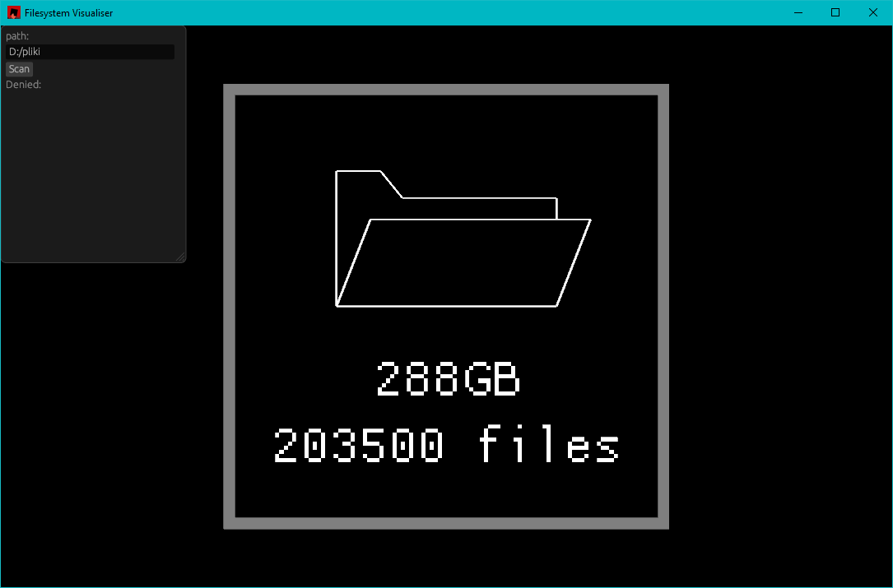
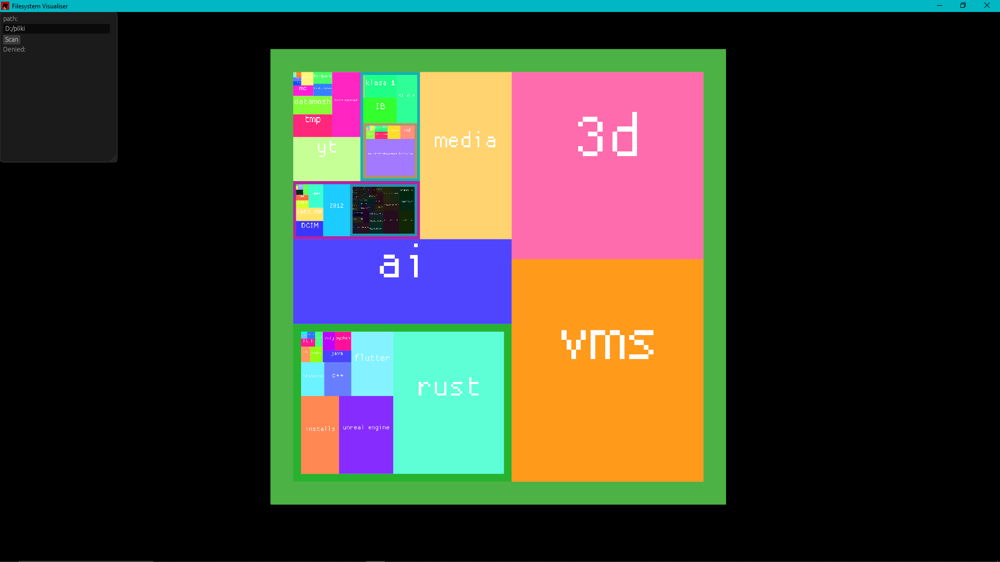
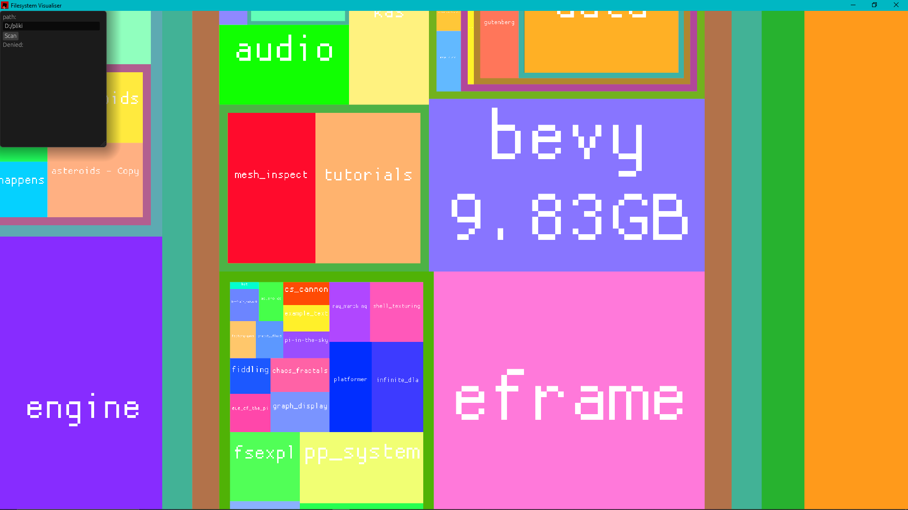

# Filesystem Visualiser
## A tool for graphical presentation of your files
This tool is helpful when cleaning up your hard drive. It displays the contents of a given directory as tiles with sizes proportional to the size of the files they represent. You can go deeper into the filesystem to diagnose which directories take up the most space.

### Select a directory, and the program will scan it:

### Then it will display the contents of the directory as tiles:

### You can go deeper into the filesystem:

When a path appears below the "Denied" label in the upper left corner of the screen, it means the program doesn't have the permissions to access the path. To reduce the number of denied paths, run the program with administrator privilages.

# Installation
See the releases tab to the right.

# Usage
* Drag with RMB - pan around
* Scroll - zoom
* Right click - split folder
* Left click - unsplit folder
* Colorful tiles are folders, dark tiles are single files. 

